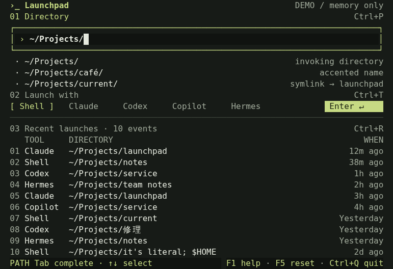

# Launchpad

A new-tab dashboard for Zellij. Fuzzy-find a directory and launch a shell or
coding agent in place of the dashboard. The input starts at the invoking cwd:
press **Enter once** for the default shell. Launch names the originating tab
`directory · command label` (for example, `notes · Shell`). F5 restores that cwd.

Directory search is restricted to HOME. **Without configuration, only Shell is
shown**, using Zellij's configured default shell. Add your own commands in the
plugin's KDL block; the selected directory is their literal working directory.
There are no executable availability checks. Launch closes the dashboard;
configured command panes close on zero or nonzero exit without returning to it.

The ten most recently opened directories remember their last tool across panes
and sessions using Zellij's URL-shared `/cache/history.json` plus a small recovery
journal. History records launch attempts, not agent success. Changing the plugin
URL or deleting its cache starts fresh. [Persistence details](docs/history.md).



## Run in Zellij

Requires Rust (via rustup) and Zellij. Tested with Zellij 0.45.1.
Run these commands from the repository root:

```sh
rustup target add wasm32-wasip1
cargo build --locked --release -p launchpad-plugin --target wasm32-wasip1
```

For **Shell only**, from a shell inside Zellij:

```sh
zellij action launch-plugin --skip-plugin-cache -- \
  "file:$(pwd)/target/wasm32-wasip1/release/launchpad-plugin.wasm"
```

The plugin is a single `.wasm` file with no companion executable. After rebuilding,
close the old plugin pane and launch it again with the command above.
Zellij 0.45.1 requires session-environment access, **Full disk access**, and
**Change application state** (one startup reload to map workers to HOME), plus
**Open terminals or plugins**, **Execute actions as the user**, and
**Read application state** for launching and exact-tab naming. These are
requested together; denial keeps the dashboard without starting a process.
Full disk access is broader than the application's HOME-only traversal policy.
The action permission is broader than command execution; updated instances may
prompt for it even if the old command-launch permission was cached. Missing
commands leave the original form with a generic rejection, not a held error pane.
Indexing, matching, and ordinary HOME validation run in the worker; exact invoking-cwd validation uses a main-instance remount.
The worker continuously schedules bounded scan slices without UI timer pacing,
yielding between slices for search/validation and publishing periodic progress.

Use Zellij's locked mode (normally `Ctrl+G`) so shortcuts reach the plugin.
`Ctrl+Q` closes the plugin pane, not the session.

## Configure commands

Put settings inside the plugin block in your layout or plugin alias (KDL uses
spaces, not `=`):

```kdl
commands "claude,hermes,codex"
command_claude "claude"
arguments_claude "-w"
label_claude "Claude in Worktree"
command_hermes "hermes"
label_hermes "Hermes"
command_codex "codex"
label_codex "Codex"
```

[examples/configured.kdl](examples/configured.kdl) is a complete illustrative
layout. Update its absolute WASM path if needed, then open it from this checkout:

```sh
zellij action new-tab --layout "$(pwd)/examples/configured.kdl"
```

Shell stays first and initially selected. `commands` orders stable IDs; whitespace
is trimmed, empty segments ignored, and the first duplicate wins. Each ID needs
`command_<id>` (one literal executable name/path, **not a command line**).
`arguments_<id>` is shell-style lexical splitting only: quotes and escapes group
arguments, including empty quoted arguments; `$HOME`, `;`, `$(...)`, globs and
other metacharacters are never expanded or executed. Use an explicit `sh` / `-c`
configuration if you want shell interpretation. `label_<id>` defaults to the ID.
Different IDs may run the same executable with different arguments.

Invalid definitions are skipped with a visible error; Shell and valid commands
remain usable. F1 lists every label/error. Long selectors keep the selected entry
visible; use Left/Right or the clickable ‹/› controls. F5 preserves configuration.
History resolves stable IDs using the **current instance's configuration**;
renaming labels preserves replay, while removed IDs remain unavailable (Tab can
still copy their directories without silently choosing Shell).

Use KDL for lists: Zellij 0.45.1's CLI `--configuration` splits at every comma and
cannot encode a multi-ID `commands` value. Layouts and KDL aliases do not have
that limitation. [Exact syntax, bounds, and examples](docs/configured-commands.md).

## Controls

- `Ctrl+P` / `Ctrl+T` / `Ctrl+R`: focus the path, tool selector, or history.
- Type `notes` or `nts` to try fuzzy directory matching. Use arrows and `Enter`
  to accept a suggestion, then choose a tool and press `Enter` to replace this pane.
- Click to select directories, tools, or history; click the launch/replay action
  to launch. Scroll to browse lists.
- `Esc`: go back or dismiss suggestions. `F1`: full keyboard help.
- `F5`: refresh HOME and shared history; reset the form. Command configuration is preserved.
- In history, `Tab` copies, `Enter` revalidates/replays, `Delete` removes the selected
  entry, and `Ctrl+L` twice clears shared history (`Esc` cancels).

The UI is centered and capped at 160 terminal columns. Relative paths start at
HOME. The index respects `.gitignore` and `.ignore`, and prunes hidden directories,
`.git`, and `node_modules`. Hidden/ignored paths can still be entered literally;
symlinks are rejected except for the exact host-supplied invoking cwd. That one
directory can also be outside HOME; it is validated without expanding search.
Deleted/inaccessible cwd fails visibly, never falling back to HOME. Indexing is
incremental and capped, with visible limits.

Typing and paste are capped at **100 Unicode scalar values** (not UTF-8 bytes or
visual graphemes); excess input is ignored. Invoking/completed/history paths are kept
intact even when longer, and remain valid launch targets; delete or clear them
before inserting more text. Fuzzy queries over 100 scalars, including after HOME
expansion, return no suggestions rather than allocating oversized matcher
buffers. Bare short queries still find long paths; literal path validation and
the separate 4096-byte filesystem safety limits are unchanged.

## Standalone prototype

The same UI also runs outside Zellij, with safe **simulated launches only**:

```sh
cargo run --locked --release
```

Plugin configuration `demo "true"` uses fixtures and simulates launches without
permissions. `simulate_launch "true"` keeps real HOME search but simulates launches
for development tests. `F6` is an illustrative availability toggle, not command discovery.

## Development

Built with Ratatui, the serial `ignore` walker, and embedded Frizbee matching. The native executable and Zellij
plugin share the application state and renderer.

```sh
cargo test --workspace --locked
```

Run `bash tools/verify_plugin.sh` for builds, tests and isolated real-host fixture
launches (no coding agents). See [launch behavior](docs/real-launch.md), the
[spec](SPEC.md), [HTML mockup](design/launchpad.html), and
[search implementation notes](docs/home-search.md) for policy and verification.
